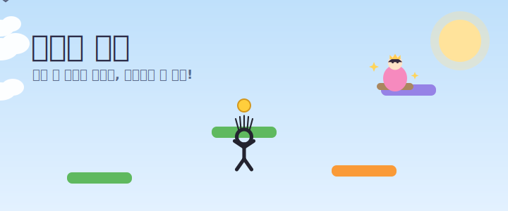

# 졸라맨 점프 (Doodle Prince)



> **"아슬아슬, 더 높이."** — 졸라맨이 하늘 위에 갇힌 공주를 구하러 끝없이 위로 점프하는 두들점프 게임.
> 8살 은찬이를 위해 만들었습니다. 좌우 화살표 하나로 누구나 30초 만에 즐길 수 있어요.

### 🎮 [▶ 지금 바로 플레이하기](https://dargma.github.io/jump/)
설치 없이 브라우저에서 바로! (PC 권장 — 키보드 좌우 화살표)

> 🎬 위 배너는 **움직이는 애니메이션(SVG)** 입니다. 브라우저나 GitHub에서 졸라맨이 통통 뛰고 구름이 흐릅니다.

---

## 📖 이야기
공주가 하늘 성에 갇혔어요. 졸라맨이 구하러 출발!
**풀숲 → 노을 하늘 → 우주**, 세 세계를 차례로 올라 공주를 만나면 끝.

## 🎮 조작법 (이게 전부)
| 동작 | 키 |
|---|---|
| 왼쪽 / 오른쪽 | **← →** (또는 A / D) |
| 점프 | **자동** (버튼 없음) |
| 아이템 사용 | **스페이스** (또는 ↑) |
| 다시하기 | **스페이스 / 클릭** (게임오버 후) |

## ✨ 게임 요소
- **3 스테이지**: 풀숲 · 노을 하늘 · 우주. 셋 다 통과해야 공주를 만난다.
- **스테이지 보상**: 클리어할 때마다 아이템(날개·로켓)을 받아 다음 스테이지에서 사용.
- **캐릭터 선택**: 파랑이·분홍이·초록이·아저씨(반머리+콧수염) 중 골라 시작.
- **발판 4종**: 🟩 일반 · 🟧 트램펄린(콩! 높이 점프) · ☁️ 구름(한 번 밟으면 사라짐) · 🟪 움직이는 발판.
- **통통이 몬스터**: 위에서 밟으면 크게 튕기고 점수! (데미지 없는 친구)
- **아이템 가방**: 날개·로켓·순간이동을 주워 모았다가 스페이스로 사용.
- **코인**: 주우면 점수 보너스 + 반짝.
- **하트 3개**: 즉사 없음. 아래 발판에 늘 걸리고, **많이 떨어지면** 하트가 줄며 "아야!" 연출.
- **하늘 변화**: 올라갈수록 낮 → 노을 → 밤(별) → 우주로 배경이 부드럽게 바뀐다.
- **최고기록 저장**: 점수는 브라우저에 저장되어 다음에도 남아요.

## ▶ 실행 방법
**가장 쉬운 방법(윈도우 PC):** `start_game.bat` **더블클릭** → 서버가 자동으로 켜지고 게임이 열립니다. (검은 창은 켜둔 채로 두세요.)

수동으로 하려면 — ES 모듈을 쓰므로 **로컬 서버**로 열어야 합니다 (인터넷 필요 — 엔진/폰트 CDN 사용).
```bash
cd doodle-prince
python -m http.server 8000
# 브라우저에서 http://localhost:8000
```
> ⚠️ `index.html` 더블클릭(file://)으로는 동작하지 않습니다. 꼭 위 서버로 여세요.

## 🛠 기술
- 엔진: [Kaplay](https://kaplayjs.com) (CDN 로드, 빌드 없음)
- 정적 사이트 + ES 모듈. 에셋 없이 선·도형과 Web Audio 합성으로 그림·소리 구현.
- **설계 원칙**: 바꿀 값(config) ↔ 로직(src) 분리. 손맛 숫자는 `config/`에서만 조정.

## 📂 폴더 구조
```
doodle-prince/
├─ index.html
├─ config/      tuning.js · items.js · platforms.js · stages.js · characters.js
├─ src/         main.js · player.js · platform.js · item.js · draw.js · audio.js
│               scenes/ start.js · howto.js · game.js · gameover.js
├─ assets/      intro.svg (소개 애니메이션)
├─ GDD.md · CLAUDE.md · README.md
```

## 🎚 손맛 조정 (코드 안 건드리고 숫자만)
| 바꾸고 싶은 것 | 파일 |
|---|---|
| 점프 높이 / 중력 / 이동 속도 | `config/tuning.js` |
| 전체 게임 속도 | `config/tuning.js` (`gameSpeed`) |
| 스테이지 개수 · 테마 · 높이 · 보상 · 스토리 | `config/stages.js` |
| 발판 종류 · 등장 빈도 · 점프 세기 | `config/platforms.js` |
| 아이템 효과 · 등장 확률 | `config/items.js` |

---

만든 이유: 은찬이가 "방금 거의 신기록이었는데!" 하며 한 번 더 누르고 싶게. 💛
